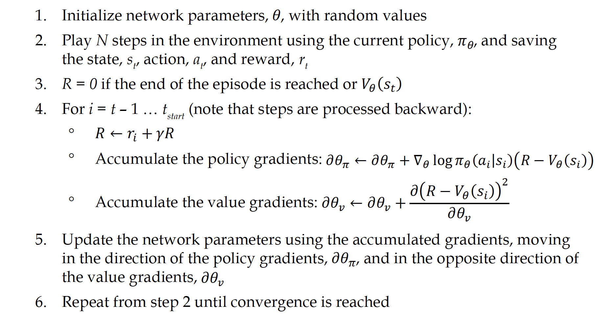
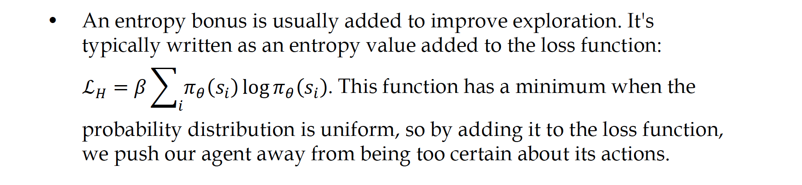
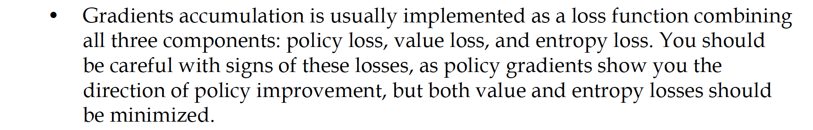
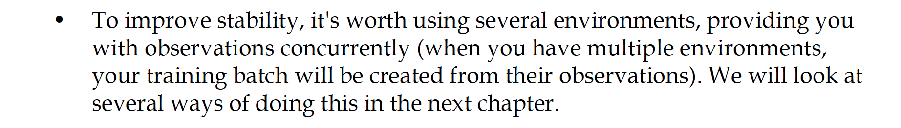

# My A2C implementation as PL system

## The Algorithm

Credit: [2 - A2C implementation from Deep-Reinforcement-Learning-Hands-On-Second-Edition (pages 315-317)](https://github.com/PacktPublishing/Deep-Reinforcement-Learning-Hands-On-Second-Edition/blob/master/Chapter12/02_pong_a2c.py)

From a training point of view, we complete these steps:



The preceding algorithm is an outline and similar to those that are usually printed
in research papers. In practice, some considerations are as follows:





The separate parts:
- Data module
- Neural Nets
- PL module
- Callbacks
- Data set

## `CartPole-v0` parameters:
```
MAX_EPOCHS = 1000  # maximum epoch to execute
MAX_LENGTH_OF_A_GAME = 10000
LR = 3e-5  # learning rate
GAMMA = 0.99  # discount factor
HIDDEN_SIZE = 256
```
A2C net:
```
class ALGNet(nn.Module):
    """
    obs_size: observation/state size of the environment
    n_actions: number of discrete actions available in the environment
    # hidden_size: size of hidden layers
    """

    def __init__(self, obs_size: int, n_actions: int):
        super(ALGNet, self).__init__()
        self.critic_linear1 = nn.Linear(obs_size, HIDDEN_SIZE)
        self.critic_linear_hidden = nn.Linear(HIDDEN_SIZE, HIDDEN_SIZE)
        self.critic_linear2 = nn.Linear(HIDDEN_SIZE, 1)

        self.actor_linear1 = nn.Linear(obs_size, HIDDEN_SIZE)
        self.actor_linear_hidden = nn.Linear(HIDDEN_SIZE, HIDDEN_SIZE)
        self.actor_linear2 = nn.Linear(HIDDEN_SIZE, n_actions)
        self.n_actions = n_actions
        self.obs_size = obs_size
        self.entropy_term = 0

    def forward(self, state):
        state = Variable(torch.from_numpy(state).float().unsqueeze(0))
        value = F.relu(self.critic_linear1(state))
        value = F.relu(self.critic_linear_hidden(value))
        value = self.critic_linear2(value)

        policy_dist = F.relu(self.actor_linear1(state))
        policy_dist = F.relu(self.actor_linear_hidden(policy_dist))
        policy_dist = F.softmax(self.actor_linear2(policy_dist), dim=2)

        return value, policy_dist
```

## `LunarLander-v2` parameters:
```

```
A2C net:
```

```

## Thanks to:

- [1 - Deriving Policy Gradients and Implementing REINFORCE](https://medium.com/@thechrisyoon/deriving-policy-gradients-and-implementing-reinforce-f887949bd63)
- [2 - A2C implementation from Deep-Reinforcement-Learning-Hands-On-Second-Edition (pages 315-317)](https://github.com/PacktPublishing/Deep-Reinforcement-Learning-Hands-On-Second-Edition/blob/master/Chapter12/02_pong_a2c.py)
- [A2C `higgsfield` implementation](https://github.com/higgsfield/RL-Adventure-2/blob/master/1.actor-critic.ipynb)
- [REINFORCE+A2C (google colab)](https://colab.research.google.com/github/yfletberliac/rlss-2019/blob/master/labs/DRL.01.REINFORCE%2BA2C.ipynb#scrollTo=aNH3udIuyFgK)
- [Chris Yoon](https://towardsdatascience.com/understanding-actor-critic-methods-931b97b6df3f)
- [Optimization In Pytorch-Lightning](https://pytorch-lightning.readthedocs.io/en/latest/common/optimizers.html#automatic-optimization)
